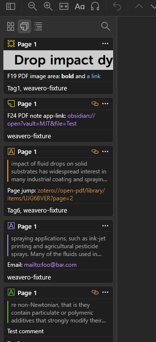
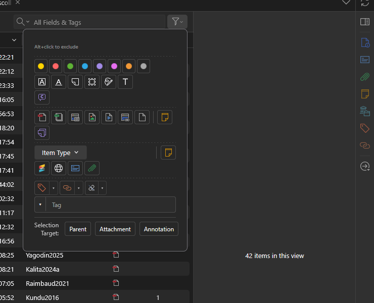
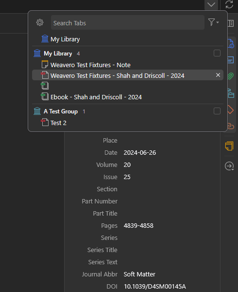
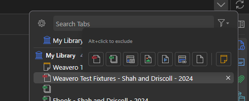
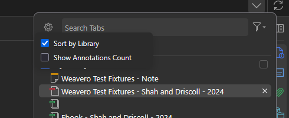
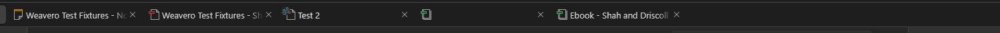
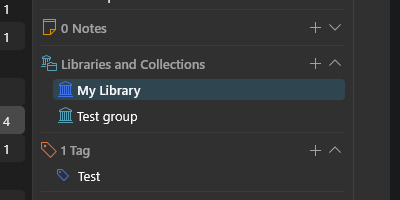

<h1>
  
  Weavero
</h1>

[](https://www.zotero.org)
[](https://www.zotero.org/support/dev/client_coding/zotero_7_for_developers)
[](https://github.com/mjthoraval/Weavero/actions/workflows/test.yml)

[](https://github.com/mjthoraval/Weavero/releases/latest)
[](https://github.com/mjthoraval/Weavero/releases)
[](LICENSE)

A Zotero plugin to make clickable links and filter your library — it turns URLs in annotation comments and notes into clickable links, and adds a fast filter pane, related-item plumbing, and items-tree columns on top of the standard library view.

Out of the box, `https://`, `http://`, and `zotero://` links are recognised everywhere a comment is shown. Sixteen extra schemes (`mailto:`, `obsidian://`, `vscode://`, `slack://`, `notion://`, …) can be toggled per-scheme.

## Features

**Clickable links in annotation comments** across the items tree, right item pane, reader sidebar, in-PDF popup, link badges over annotation icons, and notes. Each surface is independently toggleable.

- **Two display modes** (preferences):
  - **Inline** — URLs, markdown, and app links render directly in the comment; an icon opens a popup with the full formatted view when the row is clipped.
  - **Icon & Popup** — Comments stay plain text; an icon next to each annotation opens the popup. Per-content-type sub-toggles for URLs / markdown / app-links.
- **Three colour buckets** so each kind of link reads at a glance: blue for `http(s)`, orange for `zotero://`, purple for app-scheme links.
- **Inline markdown** — `**bold**`, `*italic*`, `~~strike~~`, `` `code` ``, `[label](url)`.
- **App-link skip-confirm** — optional opt-in that bypasses Firefox's *"Allow this site to open the … link?"* prompt.
- **Right-click "Copy Link"** on any rendered URL.



**Filter popup** — a toolbar `▼` next to the search box opens a compact filter panel. Click to include, Alt+click to exclude.

- Annotation **color**, **type**, **has-comment**
- **Attachment** file type
- **Item Type** (native menulist + icon-only chips for selected types)
- **Cross-level**: *Has Related*, *Has Links* — applied across every row kind
- **Multi-select search**: Tag, Author, Added By, Collection, Saved Search. Colored tags rendered like Zotero's tag selector (colored block first by position, then plain — on separate rows).
- **Selection Target**: Parent / Attachment / Annotation tri-state — controls Ctrl+A scope and dims out-of-scope rows.
- Strict per-row matching: filtering keeps only items that match; ancestors are kept for tree shape, descendants are not auto-pulled.

See [Filtering rules](docs/filter-rules.md) for the full logic — what counts as a real match, how cross-level chips scope, how the quick search and chip filter combine, and how Selection Target picks rows.



**Tabs menu.** The "List all tabs" dropdown gets a structured layout:

- **Library grouping** — section headers (themed library icon + name + tab count); the Library tab stays above all sections.
- **Per-library tickbox filter** — click to include, Alt+click to exclude. Hidden tabs disappear from the popup *and* from the main tab strip; the toolbar tabs-menu button picks up an accent tint while any filter is active.
- **File-type filter** (funnel button) — same theme-aware attachment icons as the items-tree filter (PDF / EPUB / Snapshot / Image / Video / Web Link / Other File), plus a yellow Note tile. Same Alt+click-to-exclude tristate, same `Alt+click hint / Clear / Clear and Close` header.
- **Settings** (gear button) — *Sort by Library* and *Show Annotations Count* toggles. The annotation count badge on each tab row matches the item-pane attachment row's display.


&nbsp;

&nbsp;


**Group-library tab visuals.** Tabs whose item lives in a group library get a small "Group Libraries" cluster glyph in the top-left corner of the file-type icon, plus a custom tooltip showing the tab title and a `[library icon] Library Name` header.



**Item-pane libraries highlight.** When an item is replicated across libraries (linked items), the row matching the displayed item's library gets an accent background in the *Libraries and Collections* section of the item pane.




**Items-list columns** (icon-only, hidden by default; enable via column-picker right-click):

- **Annotations** — count of annotations on attachments; sums across attachments on regular items.
- **Related** — count of related items per row.

**Right-click menus.**

- *Items list* — **Copy Item Link** (`zotero://select/.../items/<key>`, multi-select joins with newlines) and **Add Related…** (Zotero's select-items dialog, links the chosen items as `dc:relation` peers).
- *Collections tree* — **Copy Collection Link**.
- *Reader (right-click on the page)* — **Copy Link to This Page** in a PDF (`zotero://open/.../items/<key>?page=N`, N = the page you clicked, even in spread / continuous-scroll layouts), or **Copy Link to This Location** in an EPUB / web snapshot (`?cfi=…` / `?sel=…` for the element under the cursor). With text selected it becomes **Copy Link to Selected Text** — for EPUB / snapshots that's a `?cfi=`/`?sel=` link to the exact passage; for PDFs it stays page-level (no `?rects=` URL form exists yet — [zotero/zotero#4508](https://github.com/zotero/zotero/issues/4508)). All of these are standard `zotero://open` links — they work without the plugin and from other apps.
- `zotero://` URI handler now resolves `…/collections/<key>` and `…/searches/<key>` paths (group-library variants supported), `?cfi=` / `?sel=` location params, and `…/items?itemKey=K1,K2` multi-select, and switches focus to the library tab when followed from a note.

**Related-items badge.** Annotations with related items show a chain badge in the items tree; click opens a popup listing the relations.

## Install

1. Download the latest `weavero-v<version>.xpi` from the [Releases page](https://github.com/mjthoraval/Weavero/releases/latest).
2. In Zotero: `Tools → Plugins → ⚙ → Install Plugin From File…` → pick the XPI.
3. Restart Zotero if prompted.

## Configure

Open `Tools → Plugins → Weavero → Preferences` to enable/disable individual URL schemes and the optional markdown rendering.

## Build

Plugin source is TypeScript under `src/`. A Zotero plugin ships as a zip with a `.xpi` extension, but the source has to be bundled first:

```bash
npm install        # one-time
npm run build      # esbuild bundles src/ → .scaffold/build/weavero.xpi (+ update.json with the XPI's SHA512 hash)
```

(Through the pre-TypeScript releases there was also a no-Node manual-zip path — `scripts/build.ps1` zipping `src/*` directly. That no longer applies now that `src/` is TypeScript and needs bundling; use `npm run build`.)

## Development

Developed with [Claude Opus 4.7](https://claude.ai) and [MCP Server Zotero Dev](https://github.com/introfini/mcp-server-zotero-dev) (hot-reload + privileged-context JS for fast iteration).

The Node toolchain (optional but recommended) provides:

```bash
npm install              # one-time setup
npm run typecheck        # tsc --noEmit, hard-gated to 0 errors
npm test                 # Mocha + Chai inside a temp-profile Zotero (56 specs, ~10 s)
npm run build            # build the XPI to .scaffold/build/
npm start                # hot-reload dev loop (auto-reload on src/ changes)
npm run release          # interactive: bump → tag → push (CI then publishes)
```

Tests run inside a separate Zotero instance against a temp profile — your primary library is unaffected. CI runs the same suite headlessly on every PR and on every push to `main`.

Build/test tooling is all `devDependencies` (nothing from npm ships in the XPI): `typescript` (the `typecheck` gate), `zotero-plugin-scaffold` (the esbuild-based bundler + XPI packer + temp-profile test runner behind `npm run build` / `test` / `start` / `release`), `zotero-types` (Zotero's TypeScript definitions), and `mocha` + `chai` (+ their `@types`).

## Compatibility

- Zotero 7.0+ (declared `strict_min_version: 7.0`, `strict_max_version: 10.*`).
- Tested on Zotero 10.0-beta.

## License

[GNU Affero General Public License v3.0](LICENSE) — same license as Zotero itself.
