# How the Weavero filter decides what to show

The complete rule set, in plain English, with worked screenshots. Read top to bottom — each section builds on the previous one. Every section title below is a toggle — click it to collapse or expand. Use the contents list to jump.

## Contents

- [Vocabulary](#vocabulary)
- [Reading the screenshots](#reading-the-screenshots)
- [Rule 1 — Same-level same-category chips OR together](#rule-1--same-level-same-category-chips-or-together)
- [Rule 2 — Different-category chips AND across the tree](#rule-2--different-category-chips-and-across-the-tree)
- [Rule 3 — Cross-level chips have a per-kind scope](#rule-3--cross-level-chips-have-a-per-kind-scope)
- [Rule 4 — Filter groups OR together at the top level](#rule-4--filter-groups-or-together-at-the-top-level)
- [Rule 5 — Real-match kind requirement](#rule-5--real-match-kind-requirement)
- [The quick search box](#the-quick-search-box)
- [Selection Target — what Ctrl+A picks](#selection-target--what-ctrla-picks)
- [State-level filters and small rules](#state-level-filters-and-small-rules)

---

## Vocabulary

Three concepts the rest of the document leans on.

### Levels

Every row in the items tree belongs to one of three **levels**:

- **Parent level** — regular items (papers, books, web pages) and standalone notes. The top-level rows you see when you collapse everything.
- **Attachment level** — file attachments (PDFs, EPUBs, images), web-link attachments, AND child notes attached to a regular item (called "item notes"). Anything that sits at depth 1 under a regular item.
- **Annotation level** — annotations sitting under a file attachment.

### Real match vs ancestor-keep

- A row is a **real match** (shown in white) when the filter actively picks it.
- A row is an **ancestor-keep** (shown dimmed) when it isn't itself a match but it has at least one descendant that is — Weavero keeps it visible so the tree path stays intact.

Anything that isn't either of these is hidden.

### Spine

When a chip needs to look "around" a row, it only walks the row's **spine**:

- The row itself.
- Every ancestor of the row (parent, grandparent, …, up to the root of the tree).
- Every descendant of the row (children, grandchildren, …).

Siblings — rows that share an ancestor but sit on a different branch — are **not** in the spine. The chip never sees them.

---

## Reading the screenshots

Every worked example below is a screenshot of the same small set of fixtures, so you can compare how each filter reshapes the *same* tree.

- **White text** — a **real match** (the filter actively picked the row).
- **Grey text** — a dimmed **ancestor-keep** (kept only so the path down to a match stays intact).
- **Blue band** — selected (what Ctrl+A picked).
- Coloured **"A" glyphs** are annotations; the glyph colour is the annotation's highlight colour.

Most rules show two images: the **filter popup** (so you can see exactly which chips are set) and the **result** in the items tree.

**The example library**

- **WV-DEMO-B** (book) → **Smith – Test…** (PDF) → one green + one blue annotation; plus a **Snapshot** (web-link attachment).
- **Fundamental Accessibility Tests** (book) → **Ebook** (EPUB) → one green + one yellow annotation.
- **Gulliver's Travels** (book) → an **item note** + an **Ebook** (EPUB) with several annotations.
- **The influence of liquid pool temperature…** (journal article) → a **PDF** with one blue annotation. *(used only for Rule 4)*

Unfiltered, fully expanded:

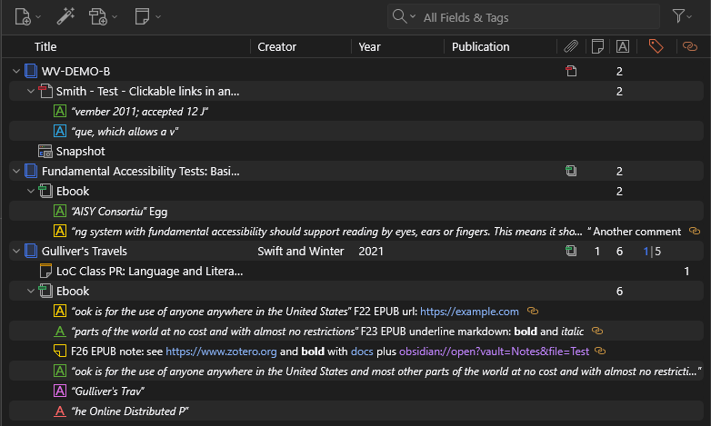

---

## Rule 1 — Same-level same-category chips OR together

> When you pick several values within one chip, or when two explicitly paired chips at the same level both fire, the row only has to satisfy **one** of them.

There are **four** such OR groups. The filter popup tints each one as its own card so they're easy to recognize:

- **Annotation Colour** — picking several colours (e.g. yellow + red) matches an annotation of *any* of them.
- **Annotation Type** — picking several types (highlight, underline, note, …) matches an annotation of *any* of them.
- **Parent-level pair** — `Item Type` ↔ `Standalone Note`. A row passes if its item type matches OR it's a standalone note.
- **Attachment-level pair** — `Attachment File Type` ↔ `Item Note`. A row passes if its file type matches OR it's an item note.

The `Has Comment` toggle sits next to the Annotation Type card but is **not** part of it — it's a separate filter, AND'd like any other (which is why it stays outside the tint).

**Example.** `Attachment File Type = EPUB` + `Item Note = is` — the two halves of the attachment-level pair.

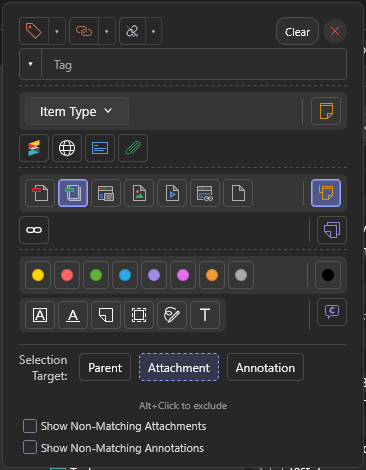

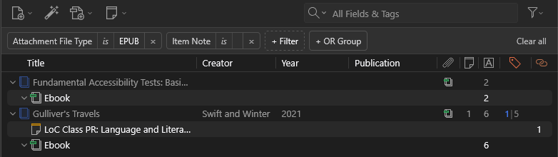

In **Gulliver's Travels** both halves fire: the **Ebook** (EPUB) is white because the file type matches, and the **item note** is white because it's an item note — either side is enough. **Fundamental Accessibility** has only the file-type half — its **Ebook** is white. Both book parents stay **dimmed**: no chip targets the parent level (see Rule 5). **WV-DEMO-B** drops out entirely — a PDF and a Snapshot satisfy neither half.

---

## Rule 2 — Different-category chips AND across the tree

> Chips from **different categories** are AND'd together. When they target **different levels**, the rows that satisfy them must sit on the queried row's **spine** — the row itself, an ancestor, or a descendant; never a sibling. When two different-category chips target the **same level**, this collapses to the obvious case: the **same row** must satisfy both.

**Example.** `Annotation Colour = green` + `Attachment File Type = PDF` — an annotation-level chip AND an attachment-level chip.

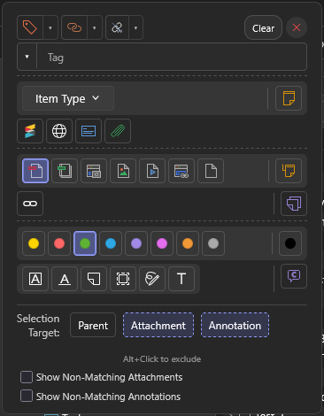

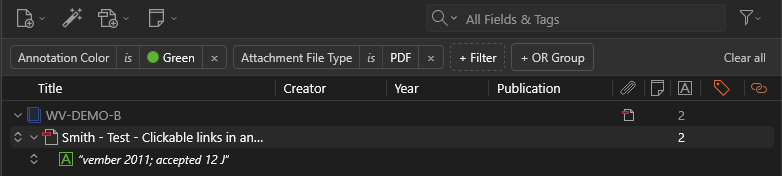

Only **WV-DEMO-B** survives. The **green annotation** is white — it's green *and* sits under a PDF. The **Smith PDF** is white — it's a PDF *and* has a green annotation on its spine. The **blue** annotation is dropped (not green); the **Snapshot** is dropped (not a PDF).

What's *absent* is the point: both EPUBs (Fundamental Accessibility, Gulliver's) also hold green annotations, but they're gone here. A green annotation under an EPUB has no PDF on its spine, so the two levels never both match on the same branch.

**Same-level variant.** `Annotation Colour = green` + `Annotation Type = highlight` are both annotation-level but different categories, so they AND on the **same row** — only annotations that are *green highlights* match. (Two values in the *same* category would OR instead — that's Rule 1.)

---

## Rule 3 — Cross-level chips have a per-kind scope

> Some chips don't pin a kind on their own — `Has Tag`, `Has Related`, `Has Link`, the `Tag`-with-value picker, `Has Annotations`, and `Item Note` (as the structural "tree has an item note" requirement). Each has a small **"Apply to" dropdown** with the three level toggles. The chip can only touch rows whose kind is ticked in its scope.

For each cross-level chip and each row:

- **Out of scope** — the chip relaxes for the row. It neither helps nor hurts.
- **In scope** — the chip is satisfied if the row itself or anything on its spine matches the chip's predicate. Otherwise the chip fails for that row.

**Example.** `Has Tag = is` — the *same* chip at two different scopes. The chip is the tag icon at the popup's top-left; the small **▾** beside it opens the scope dropdown.

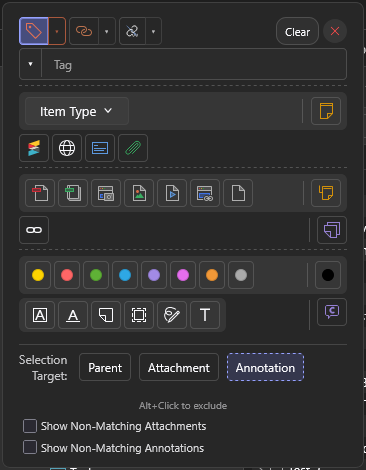

Scope = **Parent** → only the tagged book (*Gulliver's Travels*) is a real match:

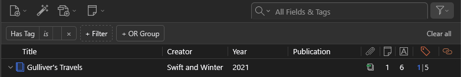

Scope = **Annotation** → only the tagged annotations are real matches; their containers dim:

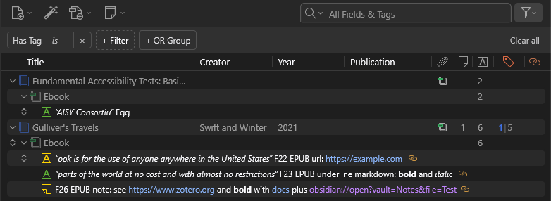

It's the same `Has Tag = is` in both results — only the scope differs. A row whose kind is out of scope is invisible to the chip.

**Interaction with Rule 1 OR pairs.** When `Item Note` is set together with `Attachment File Type` (the explicit OR pair from Rule 1), the cross-level "tree must have an item note" requirement is dropped — the OR semantics already lets either side satisfy the attachment level. With only `Item Note` set (no OR pair active), the tree-spine requirement applies normally.

---

## Rule 4 — Filter groups OR together at the top level

> Separate filter groups — added with the **+ OR Group** button — are **OR'd** at the top level: a row matches the filter if it fully satisfies *any one* group. (How chips combine *inside* a group is Rules 1–3.)

**Example.** The *same two* conditions — `Item Type = book` and `Annotation Colour = blue` — arranged two ways. One book (WV-DEMO-B) happens to contain a blue annotation, and so does a *journal article* ("The influence of liquid pool temperature…").

Both chips in **one group** → AND (only the book that *also* has a blue annotation):

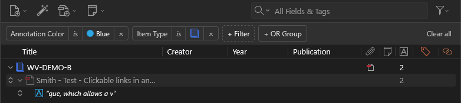

Two **OR groups** → OR (every book, plus every blue annotation wherever it lives):

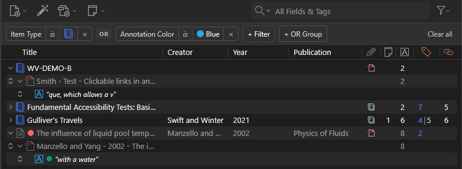

Same chips, very different result. In one group they AND (Rule 2): a tree must be a book *and* contain a blue annotation — only WV-DEMO-B qualifies. Split into two OR groups and you get the union: all three books (group 1) *plus* every blue annotation (group 2) — including the one under the **journal article**, which stays *dimmed* (it isn't a book, so group 1 doesn't promote it) while its blue annotation goes white on its own. That non-book row is the proof the OR isn't limited to books.

---

## Rule 5 — Real-match kind requirement

> A row only becomes a real match if at least one chip in the group **actively targets** its kind. A row that passes only by the relaxing-for-other-kinds rule isn't a real match — without an active target, the filter has no opinion about it.

This is what keeps the tree from flooding when you set an annotation-only chip: parents pass it (it relaxes for them) but no annotation-level chip targets parents, so parents stay dimmed (ancestor-keep), not white.

**Example.** `Annotation Colour = green` (annotation-only).

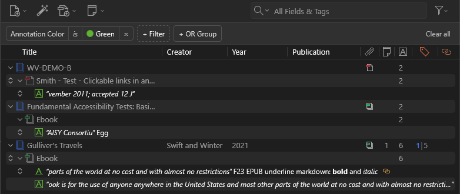

Every green annotation across all three trees is white. **Every book and every attachment is dimmed** — including the **Smith PDF**, which was white under Rule 2. The only thing that changed is the file-type chip went away: with nothing targeting the attachment level, the PDF drops back to a dimmed ancestor-keep even though it sits directly above a match.

**The quick search is the exception.** A row the quick search matched **directly** at its own level — and whose kind is in the search's scope — is a real match (white, Ctrl+A-selectable) even when no chip targets its kind.

**Example.** `Item Type = book` + quick search `Clickable`.

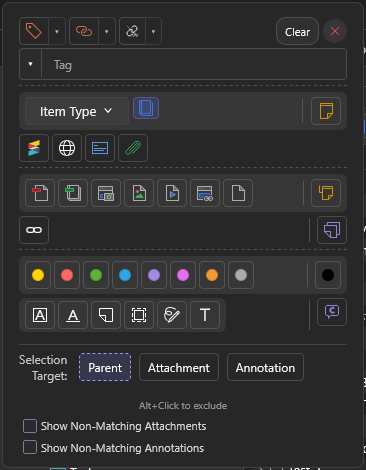

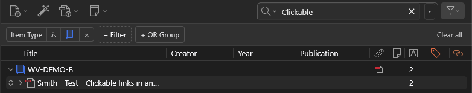

Compare the **Smith PDF** with Rule 5 above, where it was dimmed. Here it's **white** — the quick search matched its title (*…Clickable links…*) directly, with attachment scope on. The only chip (`Item Type = book`) targets the *parent* level, so under Rule 5 alone the PDF would stay dimmed; the search promotes it on its own merit. The PDF stays **collapsed** — the search matched its title, not a descendant, and auto-expand only fires when a descendant is the match.

---

## The quick search box

The toolbar's quick-search input is just Zotero's normal search. Weavero doesn't re-run it — it sees the items Zotero has already filtered to and combines them with the chip-based filter.

The quick search has its own scope dropdown ("Restrict Quick Search to:") with the same three level toggles. When the search has text:

- A row whose kind is **unchecked** in scope can't become a real match via the search — it's still kept as a dimmed ancestor when one of its descendants matches, so tree shape stays intact. With `parent = false`, parents stop appearing "in white" purely because their title matched the search, but they still serve as containers above matching descendants.
- A row whose kind is **checked** in scope passes the search if the row itself, an ancestor, or a descendant — with kind also in scope — actually matches the search. This is the same vertical-spine rule as Rule 3. Siblings don't count. So:
  - A web link under a parent that matched the search by title passes, as long as parent scope is on (the parent is in the link's spine, in scope, and matched).
  - The same web link fails if parent scope is off (parent in spine but out of scope → doesn't count, and the web link itself didn't match).
  - A web-link sibling of a matched PDF still fails — siblings aren't on each other's spine, regardless of scope.

The "Show Non-Matching Annotations" and "Show Non-Matching Attachments" toggles at the bottom of the popup are independent of the chip logic. They affect what Zotero itself shows under a search-matched container: hide non-matching attachments / annotations under a matched parent (default), or show all of them as context.

---

## Selection Target — what Ctrl+A picks

Selection Target chooses which row kinds Ctrl+A picks. Rows that aren't in the target are dimmed (greyed out, unselectable). Set it explicitly with the three buttons at the bottom of the popup, or leave it on the smart default:

- No filter on → every kind is in the target.
- Filter on → the target is the union of the kinds each active chip actually targets. Annotation-only chips contribute "annotation". Attachment File Type contributes "attachment". A cross-level chip contributes the kinds inside its scope.

**Example.** `Annotation Colour = green`, then **Ctrl+A**.

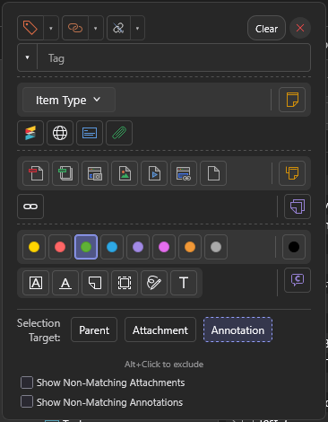

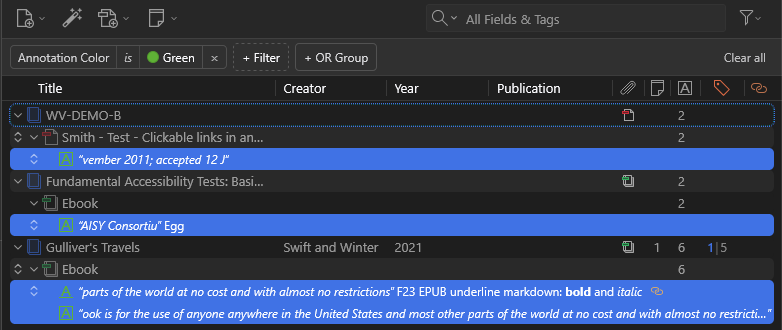

The smart default target is **annotation** (the only active chip is an annotation chip), so Ctrl+A selects only the green annotations (blue band) and skips every dimmed book and attachment — even though they're on screen. Ctrl+A picks what the filter *describes*, not the tree shape kept for readability.

Two extra rules on top of the kind check:

- **Ancestors always dim.** A row kept only because a descendant is a real match is greyed out, even if its kind is in the target. Ctrl+A picks what the filter *describes*, not the tree shape kept for readability.
- **Alt+click** a Selection Target button flips it from include to exclude. With excludes only, the target is "everything except the excluded kinds".

---

## State-level filters and small rules

- **Collections and saved searches** set at the state level apply across every group. A row that fails them is hidden regardless of any per-group logic.
- **Just-created items** stay visible for 10 seconds even if they don't yet match the filter — prevents a brand-new item from disappearing under the cursor as you finish entering it.
- **Containers auto-expand** when a deep descendant is a real match, so the match is always reachable.
- **Item-tree shape is preserved** — ancestors of any real match stay visible (dimmed), so the tree path down to the match is intact.
- **Filtering deselects what no longer matches.** When you change the filter, a selected row that's no longer a **real match** is deselected; if nothing in the new result is a real match, the selection clears entirely — the same way the quick search drops the selection when its target disappears. A dimmed ancestor-keep counts as "not a real match" here, so selecting one and then filtering deselects it.

