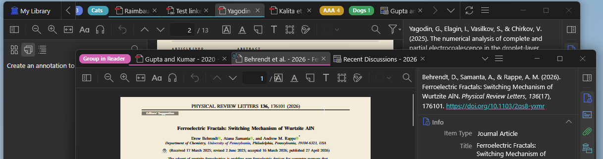

**Weavero** is a free, open-source plugin for [Zotero](https://www.zotero.org) (7 to 10-beta) that layers convenience features on top of the standard library and reader: **clickable links in annotation comments and notes**, a fast **filter pane**, **bookmarks**, related-item tools, a structured tabs menu, **tab groups and window management**, and extra items-tree columns. Every feature is individually toggleable in Preferences.

- 📦 **[Download the latest release](https://github.com/mjthoraval/Weavero/releases/latest)** (`weavero.xpi`)
- 💻 **[Source code on GitHub](https://github.com/mjthoraval/Weavero)** (AGPL-3.0, same license as Zotero)
- 🐛 **[Report an issue](https://github.com/mjthoraval/Weavero/issues)**

## Clickable links in annotations and notes

URLs, `zotero://` links, and optional app schemes (`obsidian://`, `vscode://`, and 15 more) become clickable in annotation comments and notes — across the items tree, item pane, reader sidebar, and in-PDF popups. Inline or icon-and-popup display, colour-coded by link kind, with inline markdown. Right-click menus add **Copy Item / Collection / Search Link** and **Copy Link to This Page / Location / Selected Text** in the reader — all standard `zotero://` links that work without the plugin.

**Interlinked navigation** — Ctrl/Cmd-click an internal PDF/EPUB/snapshot link to follow it in a split pane, or Shift+click to follow it in a coupled second window, without losing your place.

## Filter your library and reader

A funnel next to the search box opens a filter popup: annotation colour/type/comment, attachment and item type, *Has DOI / URL / Related / Links*, and multi-select tag, publication, author, and collection facets — with include/exclude, OR groups, and a removable chip bar above the items tree. A matching funnel in the reader filters the open document's annotations.

## Bookmarks

Bookmark items, collections, searches, and URLs from a collections-pane dropdown — and in-document locations (positions, pages, text passages, annotations) from a Bookmarks tab in the reader sidebar. Folders, drag-and-drop, search, filtering, and hover previews.

## Tabs and windows

Pinned tabs, named colour-coded **tab groups**, multi-select tabs, and a structured "List all tabs" menu grouped by library with per-library and file-type filters. Reader tabs **move or tear off to another window with no reload** — scroll position, zoom, and selection preserved. Separate reader windows can show the full item-details pane.

## Extras

Items-tree columns for annotation / tag / related counts, an *Added By* badge for annotations in group libraries with per-user colours, a Firefox-style hidden title bar, *Open in External Viewer*, and an experimental PDF outline text highlight.

## Install

1. Download the latest `weavero.xpi` from the [Releases page](https://github.com/mjthoraval/Weavero/releases/latest).
2. In Zotero: `Tools → Plugins → ⚙ → Install Plugin From File…` → pick the XPI.
3. Restart Zotero if prompted.

Weavero is also listed in the community [Zotero Addons](https://github.com/syt2/zotero-addons) plugin store — if you have that plugin installed, search for "Weavero" there.

## Safety and compatibility

Weavero never writes to or modifies your PDF files or attachments — it only layers UI on top of Zotero's standard views and keeps its own data in separate files. It is developed and tested against Zotero 10.0-beta; a few features rely on Zotero 10 APIs and may be unavailable on Zotero 9. See the [README](https://github.com/mjthoraval/Weavero#readme) for full feature documentation and the [filtering rules](https://github.com/mjthoraval/Weavero/blob/main/docs/filter-rules.md) for the filter logic.
